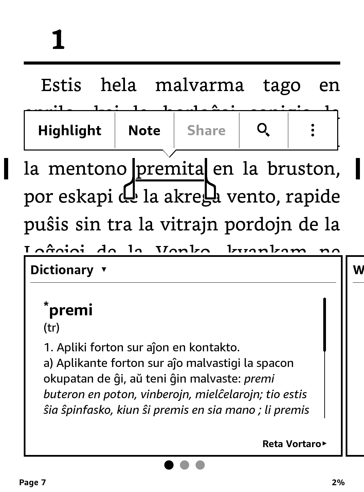

# Reta Vortaro - Kindle



This dictionary was built using data from [Reta Vortaro](https://www.reta-vortaro.de).

You'll need Python 3, xlstproc and kindlegen to generate the dictionary.

```bash
git submodule init && git submodule update
pip install -r requirements.txt
./process.sh
# this will generate the .mobi file
./kindlegen output/vortaro.opf
```

## Download

The .mobi file can be found in the [Releases](https://github.com/djuretic/revo-en-kindle/releases) section.

Then you can upload it or email it to your Kindle.